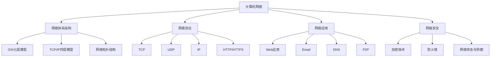

# 计算机网络学习笔记

## 思维导图

## 核心知识点

### 1. 网络体系结构

#### 1.1 OSI七层模型
- 应用层：为应用程序提供服务
- 表示层：数据格式转换、加密解密
- 会话层：建立、管理和终止会话
- 传输层：端到端的可靠数据传输
- 网络层：路由选择和逻辑寻址
- 数据链路层：物理寻址和差错检测
- 物理层：比特流的传输

#### 1.2 TCP/IP四层模型
- 应用层：HTTP、FTP、SMTP等
- 传输层：TCP、UDP
- 网络层：IP
- 网络接口层：以太网、WiFi等

### 2. 重要协议

#### 2.1 TCP (传输控制协议)
- 面向连接
- 可靠传输
- 流量控制
- 拥塞控制
- 三次握手和四次挥手

#### 2.2 UDP (用户数据报协议)
- 无连接
- 不可靠传输
- 快速传输
- 适用于实时应用

#### 2.3 HTTP/HTTPS
- HTTP方法（GET、POST等）
- HTTP状态码
- HTTPS = HTTP + SSL/TLS
- HTTP/2特性

### 3. 网络应用

#### 3.1 Web应用
- 浏览器工作原理
- Cookie和Session
- RESTful API
- WebSocket

#### 3.2 DNS系统
- 域名解析过程
- DNS记录类型
- DNS缓存

### 4. 网络安全

#### 4.1 加密技术
- 对称加密
- 非对称加密
- 数字签名
- 数字证书

#### 4.2 常见攻击与防御
- DDoS攻击
- SQL注入
- XSS攻击
- CSRF攻击

## 推荐学习资料

1. 教材
   - 《计算机网络（第7版）》- 谢希仁
   - 《计算机网络：自顶向下方法》
   - 《TCP/IP详解》

2. 在线资源
   - [MDN Web 文档](https://developer.mozilla.org/zh-CN/docs/Web)
   - [Wireshark网络分析](https://www.wireshark.org/)
   - [Cisco Networking Academy](https://www.netacad.com/)

3. 实践工具
   - Wireshark：网络协议分析器
   - Postman：API测试工具
   - tcpdump：命令行抓包工具
   - ping/traceroute：网络连通性测试

## 学习建议

1. 理论结合实践
   - 搭建简单的网络
   - 使用抓包工具分析网络通信
   - 编写网络程序

2. 循序渐进
   - 先掌握基础概念
   - 理解协议工作原理
   - 深入研究具体实现

3. 动手实验
   - 配置路由器和交换机
   - 搭建Web服务器
   - 实现简单的网络程序
